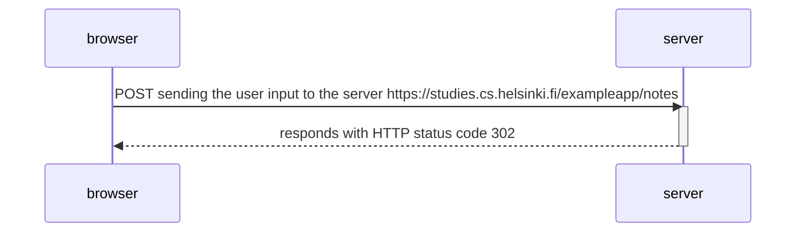

```mermaid
sequenceDiagram
    participant browser
    participant server

    browser->>server: POST sending the user input to the server https://studies.cs.helsinki.fi/exampleapp/notes
    activate server
    server-->>browser: responds with HTTP status code 302
    deactivate server
```