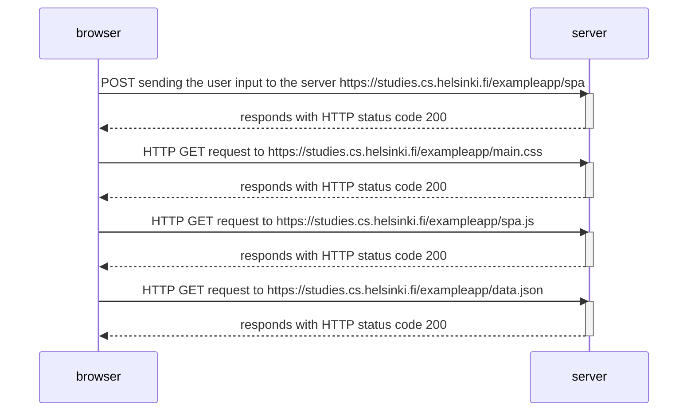

```mermaid
sequenceDiagram
    participant browser
    participant server

    browser->>server: POST sending the user input to the server https://studies.cs.helsinki.fi/exampleapp/spa
    activate server
    server-->>browser: responds with HTTP status code 200
    deactivate server
    browser->>server: HTTP GET request to https://studies.cs.helsinki.fi/exampleapp/main.css
    activate server
    server-->>browser: responds with HTTP status code 200
    deactivate server
    browser->>server: HTTP GET request to https://studies.cs.helsinki.fi/exampleapp/spa.js
    activate server
    server-->>browser: responds with HTTP status code 200
    deactivate server
    browser->>server: HTTP GET request to https://studies.cs.helsinki.fi/exampleapp/data.json
    activate server
    server-->>browser: responds with HTTP status code 200
    deactivate server
```